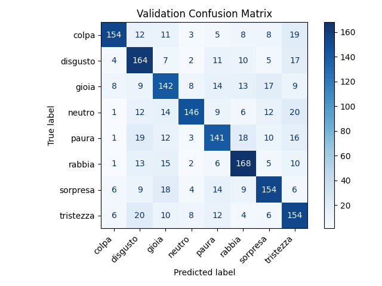
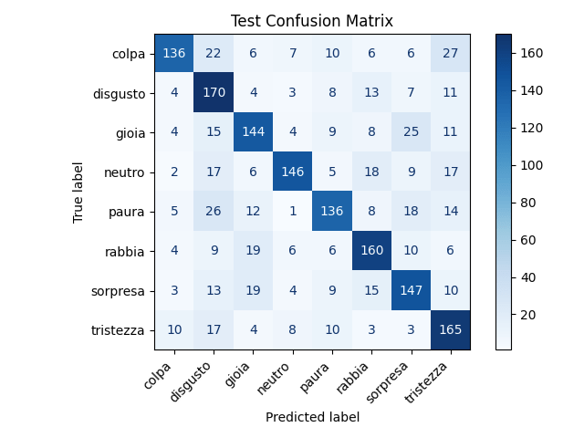
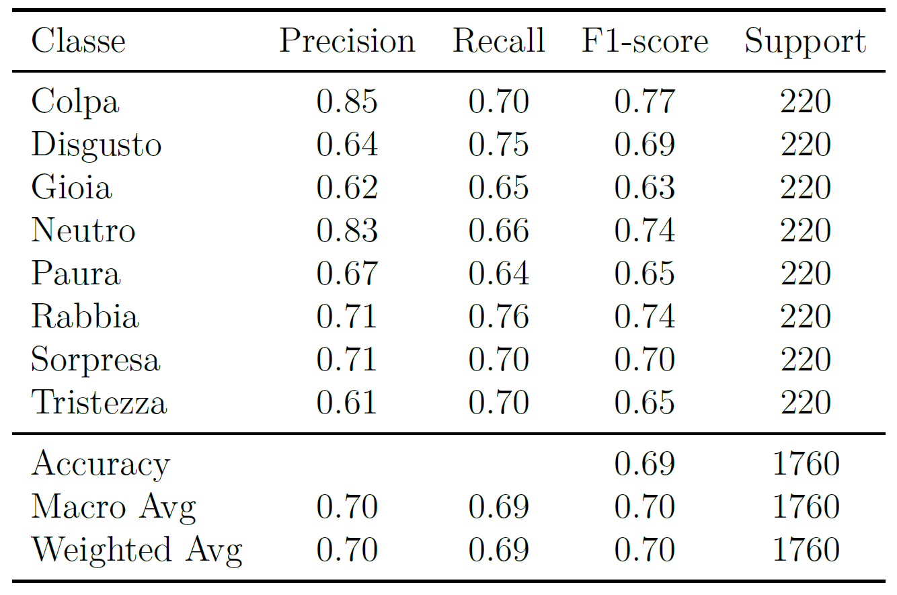
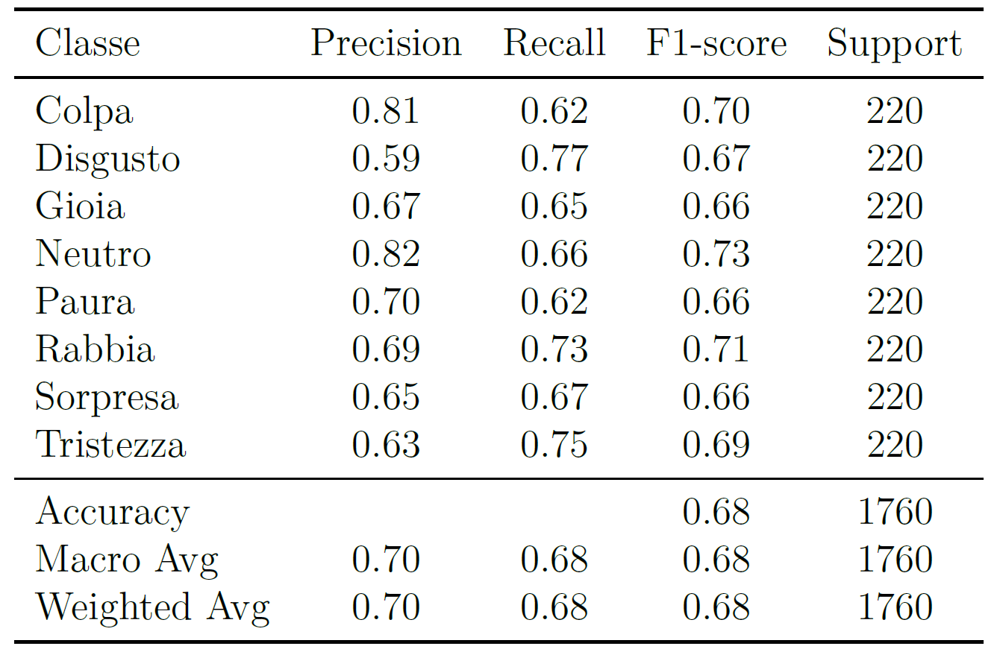
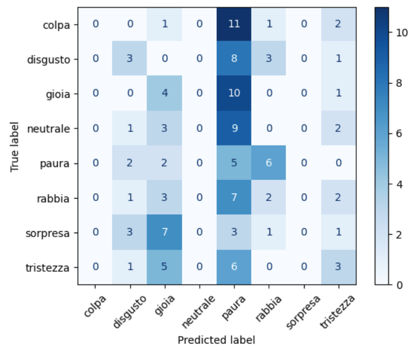
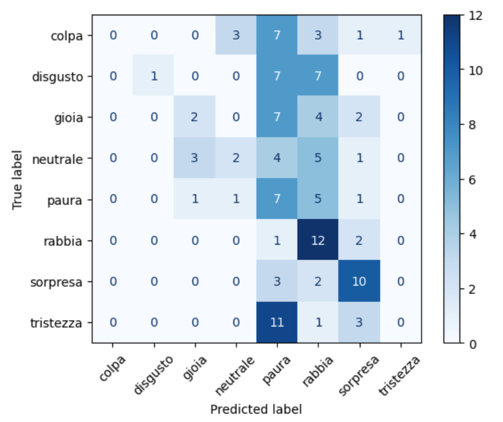
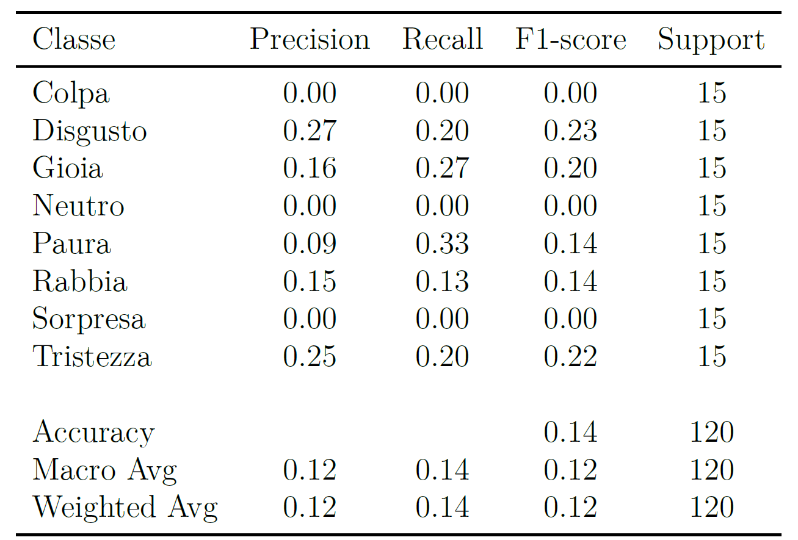
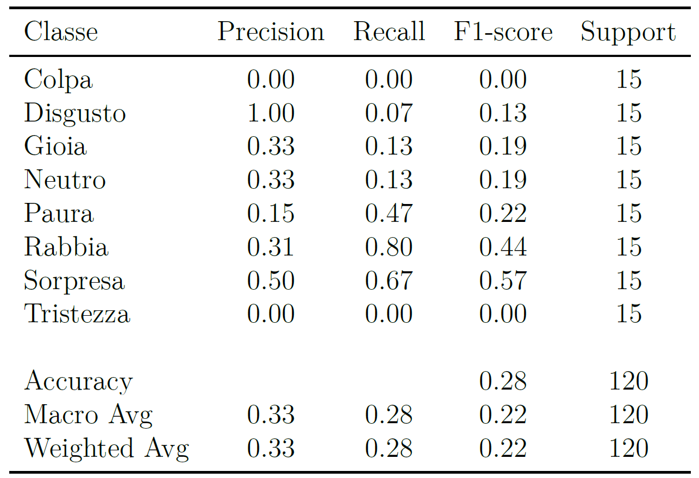

# Emotional-TTS - Emotional Speech Synthesis for the Italian Language

This repository contains the source code, scripts, and resources used for the Master's thesis  
**"Dare voce alle emozioni: TTS emozionale per la lingua italiana"**  
(*Giving Voice to Emotions: Emotional TTS for the Italian Language*)  
by **Luigi Pio Faletra** - Master's Degree in Artificial Intelligence and Security Engineering,  
"Kore" University of Enna, Academic Year 2024/2025.

---

## Project Overview

This project explores **emotional speech synthesis (Emotional Text-to-Speech, TTS)** for the **Italian language**, an area that remains relatively underexplored compared to high-resource languages such as English.  
The main goal is to assess whether **large language model-based TTS systems**, fine-tuned efficiently, can generate **natural and expressive speech** capable of conveying distinct emotional states.

The experimental work focuses on adapting the **Orpheus Multilingual** model through **LoRA fine-tuning** and the **SNAC vocoder**, leveraging multiple Italian emotional speech corpora.

---

## Methodology and Pipeline

The research integrates data preparation, emotion classification, and speech synthesis into a unified neural workflow.  
**The preprocessing, fine-tuning, and inference steps were carried out using a modified Colab notebook**, available [here](https://colab.research.google.com/github/unslothai/notebooks/blob/main/nb/Orpheus_(3B)-TTS.ipynb).

1. **Data Preprocessing**
   - Integration of DEMoS, EMOVO, EmoFilm, and Emozionalmente corpora  
   - Emotion balancing and metadata extraction  
   - Generation of unified CSV datasets with emotional tokens  

2. **Emotion Classification**
   - Training an MLP-based classifier on audio embeddings  
   - Evaluation through confusion matrices and accuracy reports  

3. **Fine-tuning and Inference**
   - Adapting the Orpheus multilingual TTS model to Italian  
   - Conditioning the model on emotion tokens  
   - Employing the SNAC vocoder for waveform generation  

4. **Evaluation**
   - **Quantitative:** training loss, WER, training time  
   - **Qualitative:** human listening tests and emotion recognition performance  

---

## Key Findings

- Strong ability to represent **basic emotions** such as *anger* and *surprise*.  
- Noticeable improvements with extended training sessions.  
- **Orpheus** demonstrates advantages in **prosodic control**, **computational efficiency**, and **multilingual scalability**, though residual limitations persist in **naturalness** and **generalization**.

---

## Results

The results are divided into two main parts:  
1. **Emotion Classification** — performance of the MLP classifier on emotion labels.  
2. **Emotional Speech Synthesis** — evaluation of the generated speech from both baseline and fine-tuned models.

---

### Emotion Classification

The classifier was trained and evaluated using embeddings extracted from emotional speech corpora.  
Below are the **confusion matrices** and **classification reports** for both the validation and test sets.

**Confusion Matrices**

The confusion matrices illustrate the model’s ability to correctly classify each emotional category.
Diagonal elements indicate correctly predicted emotions, while off-diagonal values represent misclassifications across emotional classes.

| Validation Set | Test Set |
|----------------|-----------|
|  |  |

**Classification Reports**

The classification reports summarize the quantitative performance of the model in terms of **precision**, **recall**, **F1-score**, and **overall accuracy** for each emotion class.
These metrics provide a detailed view of how well the model distinguishes between different emotional states.

| Validation Set | Test Set |
|----------------|-----------|
|  |  |

---

### Emotional Speech Synthesis

The emotional TTS experiments compared a **baseline Orpheus** model with a **fine-tuned Orpheus** model conditioned on emotion tokens.
The generated speech was evaluated in terms of both **emotion consistency** (recognition accuracy) and **linguistic intelligibility** (Word Error Rate, WER), to assess the impact of fine-tuning on expressive and natural speech generation.

**Word Error Rate (WER)**

To evaluate the **linguistic intelligibility** of the generated speech, the **Word Error Rate (WER)** was computed using the **Whisper-large-v3** ASR model on a set of 120 test prompts.  
The metric measures the ratio of word insertions, deletions, and substitutions compared to the reference text.

| Model | Average WER (%) |
|-------|-----------------|
| Baseline | 32.83 |
| Fine-tuned | 10.61 |

The results show a substantial improvement in intelligibility after fine-tuning, with the average WER decreasing from **32.83%** to **10.61%**.  
This confirms that the fine-tuned model produces **more accurate and coherent speech outputs**, aligning more closely with the target text.

**Confusion Matrices**

The following plots summarize the emotion recognition results obtained from the synthesized speech for both models.

| Baseline Model | Fine-tuned Model |
|----------------|------------------|
|  |  |

**Classification Reports**

The classification reports detail the per-class precision, recall, and F1-scores achieved by the emotion recognition model on synthesized samples.

| Baseline Model | Fine-tuned Model |
|----------------|------------------|
|  |  |

---

## Repository Structure

The repository is organized as follows:

```
main_repository/
│
├── classification/
│ ├── extract_embeddings.py
│ └── mlp_training.py
│
├── tts/
│ ├── add_emotions_column.py
│ ├── add_tokens.py
│ ├── count_emotions.py
│ ├── demos_speakers.py
│ ├── demos_transcriptions_emotions.ipynb
│ ├── emofilm_speakers.py
│ ├── emofilm_transcriptions_emotions.py
│ ├── emovo_speakers.py
│ ├── emovo_transcriptions_emotions.py
│ ├── emozionalmente_csv_file.py
│ ├── split_dataset.py
│ └── unify_csv_files.py
│
├── results/
│ ├── classification/
│ │ ├── test_classification_report.png
│ │ ├── test_confusion_matrix.png
│ │ ├── validation_classification_report.png
│ │ └── validation_confusion_matrix.png
│ │
│ └── tts/
│ │ ├── baseline_model_classification_report.png
│ │ ├── baseline_model_confusion_matrix.png
│ │ ├── fine-tuned_model_classification_report.png
│ │ └── fine-tuned_model_confusion_matrix.png
│
├── .gitignore
├── LICENSE
└── README.md
```

---

## Technologies and Resources

- **Python 3.10+**
- **PyTorch**
- **Hugging Face Transformers**
- **SNAC Vocoder**
- **LoRA Fine-Tuning**
- **Italian Emotional Speech Datasets**: DEMoS, EMOVO, EmoFilm, Emozionalmente  

---

**Italian Emotional Speech Datasets**

The experiments used the following publicly available corpora:

- **DEMoS** — [https://zenodo.org/records/2544829](https://zenodo.org/records/2544829)  
- **EmoFilm** — [https://zenodo.org/records/1326428](https://zenodo.org/records/1326428)  
- **EMOVO** — [https://kaggle.com/datasets/sourabhy/emovo-italian-ser-dataset](https://kaggle.com/datasets/sourabhy/emovo-italian-ser-dataset)  
- **Emozionalmente** — [https://zenodo.org/records/12616095](https://zenodo.org/records/12616095)

## Academic Reference

If you use this repository or its findings, please cite the following thesis:

> **Faletra, L. P. (2025).**  
> *Dare voce alle emozioni: TTS emozionale per la lingua italiana.*  
> "Kore" University of Enna - Master's Thesis in Artificial Intelligence and Security Engineering.

---

## Future Work

- Expansion of emotional datasets with natural (non-acted) recordings.  
- Integration of **advanced neural vocoders** (HiFi-GAN, BigVGAN).  
- Development of **objective perceptual metrics** for emotion evaluation.  
- Application in **empathetic voice assistants** and **automatic dubbing systems**.  

---

## Contact

**Author:** Luigi Pio Faletra  
**Supervisor:** Prof. Moreno La Quatra  
[luigipio.faletra@unikorestudent.it](mailto:luigipio.faletra@unikorestudent.it)  
[GitHub Repository](https://github.com/LuigiPioFaletra/Emotional-TTS)
